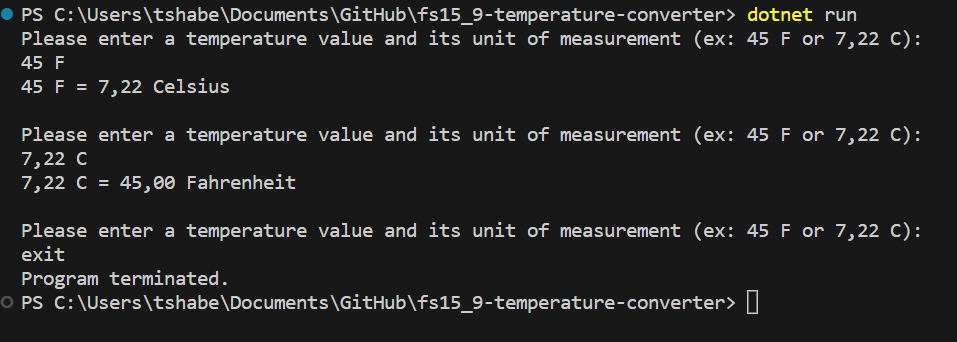

# Temperature Converter

This is a simple temperature converter program written in C# that allows users to convert temperatures between Fahrenheit and Celsius. The program prompts the user to enter a temperature value and its unit of measurement (e.g., "45 F" or "30 C"). It then converts the temperature to the corresponding unit and displays the result.

## Requirements

1. Prompt the user to input a temperature value and a temperature scale (either Celsius or Fahrenheit).
2. Convert the temperature to the opposite scale and display the result.
3. Handle invalid user inputs by displaying an error message and prompting the user to enter valid inputs.
4. Write a function called `TempConvert` to perform the temperature conversions.
5. Use `switch` statement to determine which conversion function to use based on the user's input for the temperature scale.
6. Use type pattern in the `switch` statement to validate user's input.
7. Application should run continuously, but have option to terminate the program.
8. Rewrite `README` file and add your screenshots of testing application in your terminal.
## How to Use
1. Clone or download the repository from here.
2. Open the solution in Visual Studio or your preferred C# development environment.
3. Build and run the program.
4. The program will display a prompt asking for a temperature value and its unit of measurement.
5. Enter the temperature value and unit of measurement as requested.
6. The program will convert the temperature and display the result.
7. To exit the program, type "exit" (case-insensitive) and press enter.
## Examples

Your program does not need to look exactly like the example below, but should have similar features

````
Please enter a temperature value and its unit of measurement (F or C):
45 F
45 F = 7.22 C

Please enter a temperature value and its unit of measurement (F or C):
input C
Invalid input. Please enter a valid temperature value and its unit of measurement (F or C):

Please enter a temperature value and its unit of measurement (F or C):
30 X
Invalid input. Please enter a valid temperature value and its unit of measurement (F or C):

Please enter a temperature value and its unit of measurement (F or C):
exit
Program terminated.
````

## Screenshots

---